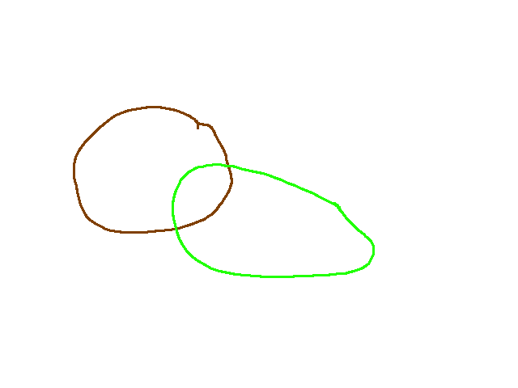
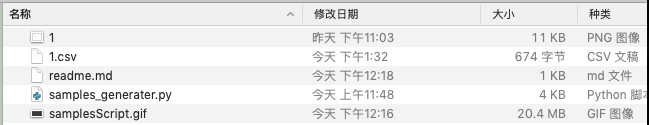
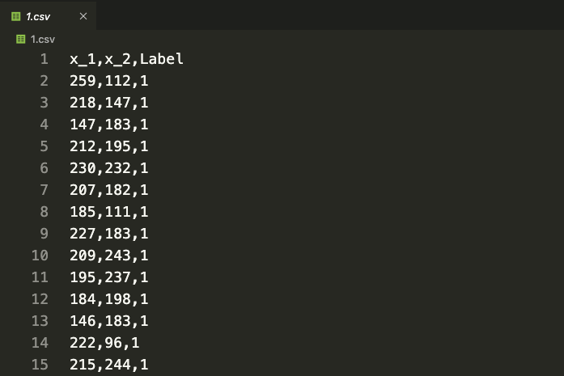
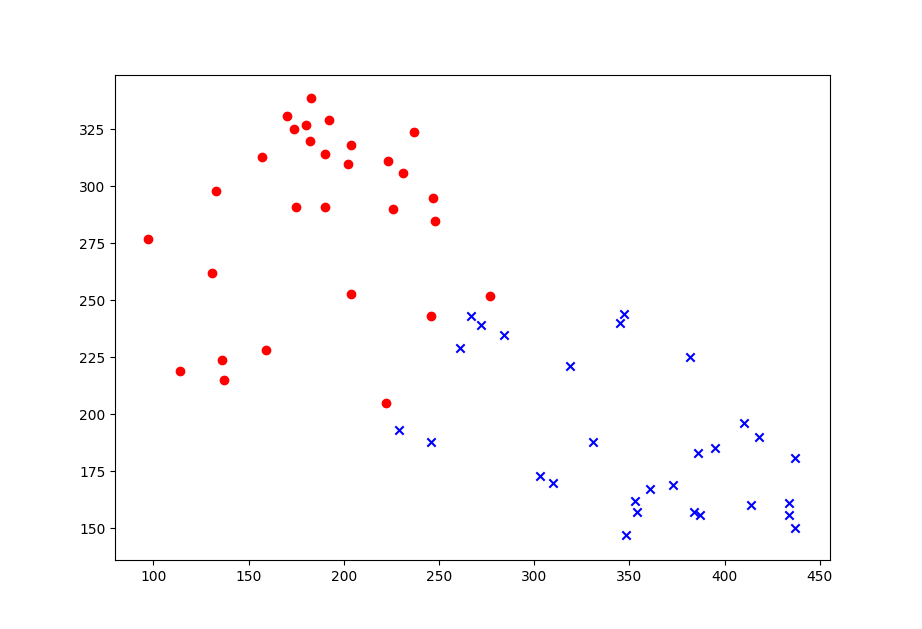

# A tool for Generating 2-D Random Samples
more details can be found: https://brainbomb.org/

In researching machine learning algorithms, especially the classification algorithms, we always need the same random samples. It becomes impossible to draw hundreds or thousands of points by hand in a certain region. So I write this little tool to generate samples from a certain region.

Firstly, we design a picture in which we draw closed shapes to represent a certain region with a special color. And then different colors for different classes. Then run the script and use the image as input, and after all colors having been detected, we input how many samples we want for each class.

the result will be stored in the same path with the input image and the result has the same name with the input image but ending with '.csv'

For example, the 1.png is stored in the same fold with the script:



and then:


after these steps, we get the result file in 'csv' form


and in the file, the data is organized as:


using the following python code
```python
import csv
import matplotlib.pyplot as plt
file_csv = open('./1.csv')
reader = csv.reader(file_csv)
result = {}
for item in reader:
 # ignore first row
 if reader.line_num == 1:
 continue
 if item[2] in result:
 result[item[2]].append([item[0],item[1]])
 else:
 result[item[2]] = []
file_csv.close()
print(result)
plt.scatter([ int(i[0]) for i in result['1']],[ int(i[1]) for i in result['1']],c = 'r',marker = 'o')
plt.scatter([ int(i[0]) for i in result['2']],[ int(i[1]) for i in result['2']],c = 'b',marker = 'x')
plt.show()
```
we can get:


## Warning!
```python
import cv2
import numpy as np
import copy
import random
import csv
from sty import fg
```
These libaries are needed.

This is a tool for generating 2-D random samples for different class, what users should do is:
1. draw class in picture with different colors
2. each class should be represented by a closed sharp(line width should less than 3 pixels))
3. input image should be of the format '.png'
4. output csv file has the same name with the input and the same path
5. can only deal with at most 100 inputs, and reboot the script will restart

